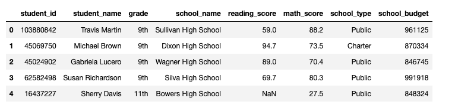

# PyCitySchools

## Overview of Analysis

In this project,we are assisting Maria,the chief data scientist for a city school district. Maria is responsible for analyzing information from a variety of sources and in a variety of formats. In this role, she is tasked with preparing all standardized test data for analysis, reporting, and presentation to provide insights about performance trends and patterns.
These insights are used to inform discussions and strategic decisions at the school and district level.We analyse the sudent funding and acedemic scores.

Requirements:

-- Jupyter Notebooks

-- Pandas libraries

-- Os libraries

## Results

As required,we performed various arithmatic and logical operations on the data provied in csv file to get the desired results.Following are the screenshots of some of the analysis work done on the data.

For detailed results and the code please refer to the jupyter notebook file below:
[Challange_book][]

## Analysis process

The whole analysis process is divided into 6 parts

### 1.Collect the Data

To collect the data,we complete the following steps:

Using the Pandas read_csv function and the os module, import the data from the new_full_student_data.csv file, and create a DataFrame called student_df.

      full_student_data = os.path.join('Resources/new_full_student_data.csv')
      student_df = pd.read_csv(full_student_data)

Using the head function to confirm that Pandas properly imported the data.
          
      student_df.head()
      
      
  
      
      

### Prepare the Data

To prepare and clean your data for analysis, complete the following steps:

  * Check for and remove all rows with NaN, or missing, values in the student DataFrame.

            # Check for null values
            student_df.isna().sum()
            
            # Drop rows with null values and verify removal
            c1_student_df=student_df.dropna(how = 'any')
            c1_student_df.isnull().sum()

  * Check for and remove all duplicate rows in the student DataFrame.

            # Check for duplicated rows
            c1_student_df.duplicated().sum()
            
            # Drop duplicated rows and verify removal
            c2_student_df = c1_student_df.drop_duplicates()
            c2_student_df.duplicated().sum()

            # Examine the grade column to understand why it is not an int
            c2_student_df['grade']
               
  * Check data types using the dtypes property.

            # Check data types
            c2_student_df.dtypes
            
  * Remove the "th" suffix from every value in the grade column using str and replace.
  
             # Remove the non-numeric characters and verify the contents of the column
            c2_student_df["grade"]=c2_student_df['grade'].str.replace("th","")
            c2_student_df['grade']
            
  * Change the grade colum to the int type and verify column types.

            c2_student_df['grade']=c2_student_df['grade'].astype(int)

  * Use the head (and/or the tail) function to preview the DataFrame.

            c2_student_df.tail(5)
 
 
 ### Summarize the Data
 
Describe the data using summary statistics on the data as a whole and on individual columns.

   * Generate the summary statistics for each DataFrame by using the describe function.

            # Display summary statistics for the DataFrame
            c2_student_df.describe()

   * Display the mean math score using the mean function.

            # Display the mean math score using the mean function
            c2_student_df["math_score"].mean()

   * Store the minimum reading score as min_reading_score.

            # Store the minimum reading score as min_reading_score
            min_reading_score=c2_student_df["reading_score"].min()
            min_reading_score
            
            
### Drill Down into the Data

Drill down to specific rows, columns, and subsets of the data.

To drill down into the data, complete the following steps:

   * Use loc to display the grade column.
  
            # Use loc to display the grade column
            c2_student_df.loc[:,'grade']

   * Use iloc to display the first 3 rows and columns 3, 4, and 5.

            # Use `iloc` to display the first 3 rows and columns 3, 4, and 5.
            c2_student_df.iloc[0:3,3:6]

   * Show the rows for grade nine using loc.

            # Select the rows for grade nine and display their summary statistics using `loc` and `describe`.
            c2_student_df.loc[c2_student_df['grade']==9].describe()

   * Store the row with the minimum overall reading score as min_reading_row using loc and the                         min_reading_score found in Deliverable 3.

            # Store the row with the minimum overall reading score as `min_reading_row`
            # using `loc` and the `min_reading_score` found in Deliverable 3.
            min_reading_row = c2_student_df.loc[c2_student_df['reading_score']== min_reading_score]
            min_reading_row

   * Find the reading scores for the school and grade from the output of step three using loc with multiple          conditional statements.

            # Use loc with conditionals to select all reading scores from 10th graders at Dixon High School.
            c2_student_df.loc[(c2_student_df['grade'] == 10) & 
            (c2_student_df['school_name'] == 'Dixon High School')][['school_name','reading_score']]

   * Using conditional statements and loc or iloc, find the mean reading score for all students in grades 11 and      12 combined.

            # Find the mean reading score for all students in grades 11 and 12 combined.
            #filled_student_df = student_df.fillna(value = student_df['reading_score'].mean())
            c2_student_df.loc[(c2_student_df["grade"] == 11) | (c2_student_df["grade"] ==                                     12),"reading_score"].mean()
            
 
### Make Comparisons Between District and Charter Schools

Compare district vs charter schools for budget, size, and scores.

Make comparisons within your data by completing the following steps:

   * Using the groupby and mean functions, look at the average reading and math scores per school type.

            # Use groupby and mean to find the average reading and math scores for each school type.
            c2_student_df.groupby('school_type')[['reading_score','math_score']].mean()
               * Using the groupby and count functions, find the total number of students at each school.

   * Using the groupby and count functions, find the total number of students at each school.

         # Use the `groupby`, `count`, and `sort_values` functions to find the
         # total number of students at each school and sort from most students to least students.
         c2_student_df.groupby('school_name')['student_id'].count().sort_values(ascending=False)

   * Using the groupby and mean functions, find the average budget per grade for each school type.

         c2_student_df.groupby(['school_type','grade'])['math_score'].mean().round(1)
            
### Summary

After performng all the steps and we were able to further analyse the data.We were able to provide financial and acedimc stats for all the school group by school type.

      #Desc list of school budgets overall
      c2_student_df.sort_values('school_budget',ascending = False).groupby('school_name')                                     [['school_name','school_type','school_budget']].head(1)

We were able to create a list of school budgets in ascending order which helps us find the schools with min and maz budgets.Further we were able to break it down by scool type and dispayed two differnt list of public and charter schools.

      #Desc. list of Public schools budget.
      c2_student_df.loc[c2_student_df['school_type'] == "Public"].sort_values('school_budget',ascending =                     False).groupby('school_name')[['school_name','school_budget']].head(1)
      #Desc list of Charter schools budget.
      c2_student_df.loc[c2_student_df['school_type'] == "Charter"].sort_values('school_budget',ascending =                    False).groupby('school_name')[['school_name','school_budget']].head(1)

We used describe function to calculate statistcal numbers i.e mean,max,min etc for the reading score and math score.By doing this we can analyse the acedemic performance of the schools.

      #Acedemics stats for schools.
      c2_student_df.groupby(['school_type','school_name'])[['reading_score','math_score']].describe()
            
We used the same function to calculate statistical numbers for school budget grouped by school type for every school.This helps us better understand the financial standing of each school.

    #financial stats for schools
     c2_student_df.groupby(['school_type','school_name'])['school_budget'].describe()
